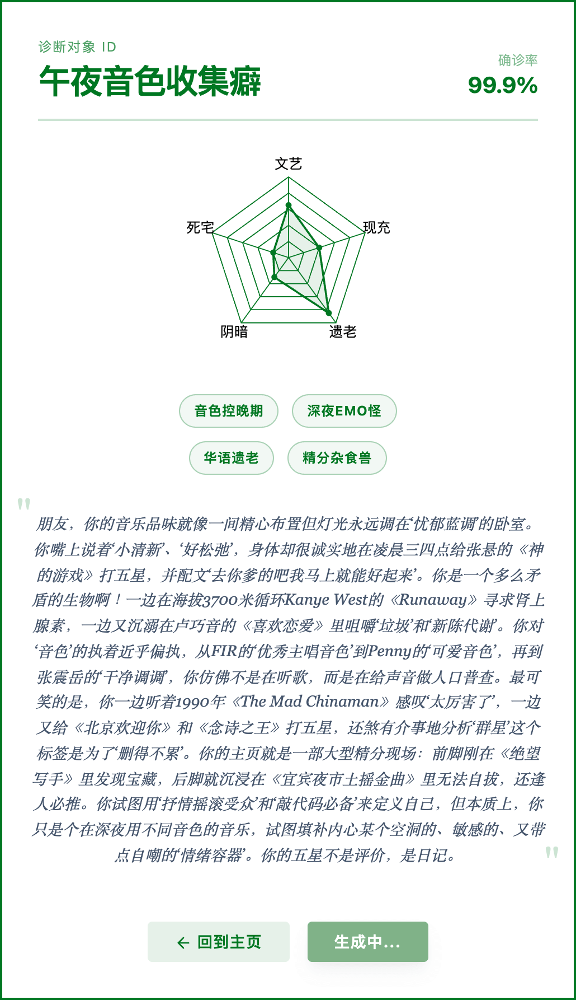

# Roast My Douban

Roast your style based on interests of a Douban user.

---

made with 99% AI, 1% Human

## Features

- **Multiple Categories**: Books, Movies, Music, and Games
- **Two Analysis Modes**: 
  - "Roast Mode" (毒舌心热): Sharp, humorous criticism
  - "Praise Mode" (夸夸模式): Warm, insightful appreciation
- **AI-powered Analysis**: Uses various LLM providers for deep analysis
- **Local API Key Storage**: Your API keys are only stored in your browser

## How to Use

1. Enter your Douban user ID or username
2. Select an analysis mode (Roast or Praise)
3. Select an analysis category (Books, Movies, Music, or Games)
4. Enter your API Key in the settings section
5. Click "Start Analysis" to generate results

## Supported LLM Providers

- Gemini (Google)
- DeepSeek
- Qwen
- ChatGPT (OpenAI)

## Support me

You can support me by Alipay (scan QR code below) or [ko-fi](https://ko-fi.com/aerisz):

## Changelog

### 2026-03-30 Updates

1. **Build & Runtime Stability**:
   - Fixed `vite.config.ts` preview `port` type mismatch by normalizing `process.env.PORT` to a valid number.
   - Cleaned up preview config formatting to avoid malformed inline comments causing config parsing confusion.

2. **Rate Limit Hardening**:
   - Updated client IP detection to prioritize trusted proxy headers (`cf-connecting-ip`, `x-vercel-forwarded-for`, `x-real-ip`).
   - Added optional `TRUST_X_FORWARDED_FOR=true` switch for environments where `x-forwarded-for` is explicitly trusted.
   - Unified rate-limit identity to pure IP for true rolling `24 h` behavior (removed date suffix).
   - Updated rate-limit response message to match rolling 24-hour semantics.

3. **Sampling Quality**:
   - Replaced biased random subset logic (`sort(() => 0.5 - Math.random())`) with Fisher-Yates shuffle before slicing.

4. **UI Background Fix**:
   - Fixed scanning/analyzing dynamic background to actually render item cover images via `background-image`.
   - Added URL escaping helper for safer CSS `url(...)` rendering.

5. **LLM Reliability & Diagnostics**:
   - Improved Gemini error reporting with extracted root cause details (instead of generic `fetch failed` only).
   - Enhanced provider fallback strategy: try all candidates in pool, then fallback to server-side providers if user-key providers all fail.
   - Added clearer final error when all configured providers fail.

### 2026-03-30 UI Polish (Certificate Export)

1. **Font Consistency in Exported Certificate**:
   - Fixed screenshot font mismatch between on-page card and exported image by waiting for fonts/render readiness before `toPng`.
   - Introduced explicit Chinese font stacks for certificate content (`certificate-sans`, `certificate-serif`) to reduce fallback differences during DOM-to-image rendering.
   - Replaced SVG text utility classes with explicit SVG font attributes for the "奖" character and seal text to avoid size/weight drift after export.

2. **Praise Badge Layout Improvements**:
   - Added left padding to praise-mode header so the top-left golden badge no longer blocks "荣光记录 ID".
   - Moved the top-left badge downward to avoid touching the top border line while keeping the badge visible.

3. **Compatibility Arrow Visual Tuning**:
   - Redesigned the arrow next to compatibility percentage into a longer up-arrow style.
   - Increased icon height and adjusted path geometry so its visual height aligns better with the percentage text.

### 2026-03-05 Updates

1. **New Features**:
   - **HTML Export Functionality**: Added ability to export Douban data as HTML table
   - **Query Limit Control**: Added input field to customize the maximum number of items to fetch (default: 200)
   - **Export Progress Feedback**: Added export status messages and loading state

2. **Technical Improvements**:
   - Updated `fetch-douban` API to support custom query limits
   - Added batch fetching logic for more efficient data retrieval
   - Improved error handling for export operations
   - Updated .gitignore file

### 2026-02-26 Updates

1. **UI Improvements**:
   - Updated praise mode result card design with golden and crimson color scheme
   - Changed top-left decoration from red flower to golden flower with red "奖" (Award) character
   - Updated "诊断对象 ID" (Diagnosis Object ID) to "荣光记录 ID" (Glory Record ID) for praise mode
   - Changed "确诊率" (Diagnosis Rate) to "契合度" (Compatibility Rate) for praise mode
   - Added upward arrow next to compatibility rate percentage in praise mode
   - Updated praise mode card styles: background, border, shadow, and text colors

2. **Technical Fixes**:
   - Fixed compilation errors related to Svelte template syntax
   - Improved responsive design for better mobile display

### 2026-03-06 Updates

1. **UI Improvements**:
   - Removed "ROAST MY DOUBAN 豆瓣标记精神状态分析" text from the main page
   - Added overlay text "ROAST MY DOUBAN 豆瓣标记精神状态分析" on the douban.webp image with light green color
   - Added blur effect when hovering over the douban.webp image
   - Added hover message box in the center of the image: "谢谢做这张图的豆瓣用户@mui如有侵权，请联系我删除"

2. **Bug Fixes**:
   - Fixed `apiKeys` state definition using `openai` key while input was bound to `chatgpt`, causing the OpenAI key field to never be saved correctly
   - Fixed rate limit bypass not checking `chatgpt` API key — users providing only an OpenAI key were still being rate-limited
   - Fixed `null` rating value incorrectly triggering "检测到愤怒" log entry during scanning animation (`null <= 2` evaluates to `true` in JavaScript)
   - Fixed `totalItems` not being reset in `reset()`, causing the progress counter to briefly show stale data when re-running an analysis
   - Fixed HTML export filtering out items that were only marked (no rating, comment, or tags) — export mode now returns all items
   - Fixed SSR/CSR hydration mismatch caused by `Math.random()` in the decorative background template; replaced with a deterministic index-based formula
   - Fixed conflicting Tailwind CSS classes (`-translate-x-full -translate-x-2`) in the radar chart tooltip positioning; replaced with `-translate-x-full -ml-2`
   - Fixed OpenAI default model fallback from `gpt-5` (invalid) to `gpt-4o`

### 2026-02-25 Updates

1. **UI Improvements**:
   - Renamed "Praise Mode" (夸夸模式) to "Extravagant Praise Mode" (夸夸奇谈)
   - Updated button colors: "Extravagant Praise Mode" now shows as red when active, while "Roast Mode" shows as green
   - Added viewport meta tag for better mobile device support

2. **AI Analysis Enhancements**:
   - Updated praise mode prompts to be more enthusiastic and hyperbolic
   - Improved the "Extravagant Praise Master" (夸夸奇谈大师) style with more dramatic language

3. **Technical Fixes**:
   - Fixed mobile display issues by adding proper viewport configuration
   - Explained the multiple network address display behavior in development mode

4. **User Experience**:
   - The praise mode now uses more lavish compliments and poetic exaggeration
   - Better responsive design for all screen sizes
